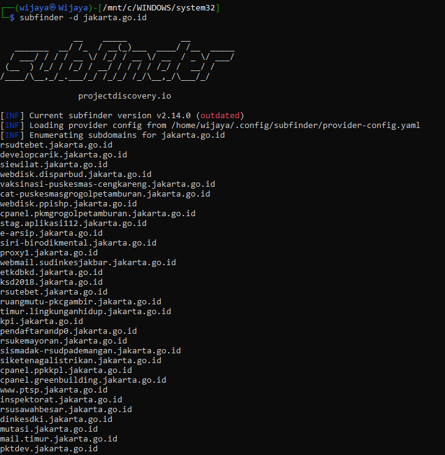
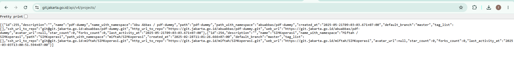
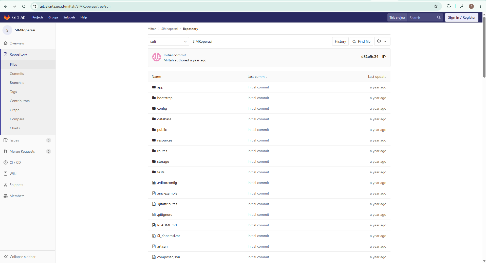
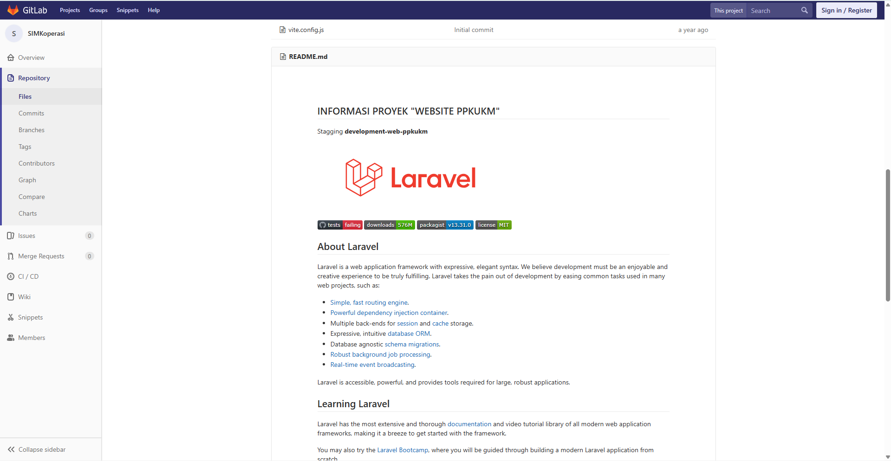
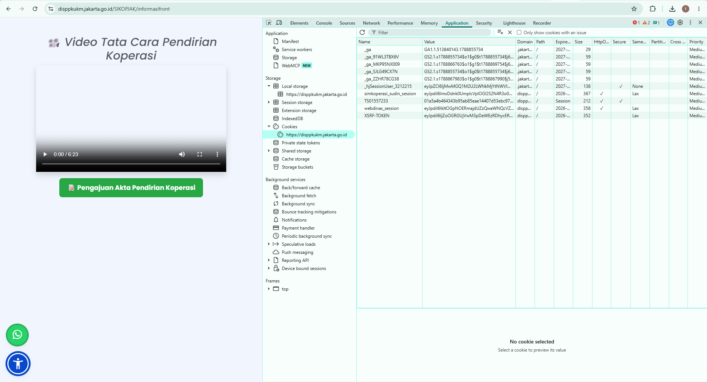
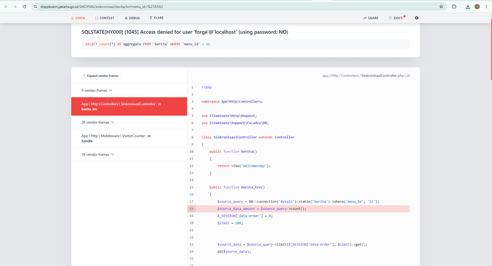

# Web Application & Infrastructure Security Assessment

> **Laporan hasil security assessment** terhadap sistem informasi pada lingkungan pemerintahan `.go.id`.
> Assessment dilakukan dengan prinsip **non-destructive security testing** dan berfokus pada identifikasi, validasi, dokumentasi, serta rekomendasi remediasi kerentanan kritis.

## Informasi Assessment

| Item | Detail |
|---|---|
| Nama | Faril Bily Wijaya |
| Division | Cyber Security – Red Team |
| Jenis Assessment | Web Application & Infrastructure Security Assessment |
| Metodologi | Reconnaissance → Vulnerability Analysis → Safe Exploitation/PoC → Reporting |
| Target | `git.jakarta.go.id` & `disppkukm.jakarta.go.id` (SIKOPJAK) |

---

# Executive Summary

Total terdapat **3 finding utama** yang terdeteksi dari eksploitasi berbasis intelijen (*Reconnaissance*) pada lingkungan target:

## Ringkasan Finding

| ID | Finding | Target | Severity | Status |
|---|---|---|---|---|
| F-01 | Public Repository Exposure (Source Code Disclosure) | `git.jakarta.go.id` | **HIGH (7.5)** | Confirmed |
| F-02 | Active Debug Code Left in Production | `disppkukm.jakarta.go.id` | **MEDIUM (5.3)** | Confirmed |
| F-03 | Sensitive Information Exposure Through Debug Interface | `disppkukm.jakarta.go.id` | **HIGH (7.5)** | Confirmed |

---

# F-01 — Public Repository Exposure (Source Code Disclosure)

- **Title:** Public Repository Exposure Leading to Full Source Code Disclosure
- **CWE:** CWE-538: File and Directory Information Exposure
- **CVSS 3.1 Score:** 7.5 (High)

## Description
Kerentanan eksposur informasi kritikal berupa kebocoran repositori kode sumber (*Source Code Disclosure*) ditemukan pada infrastruktur Pemerintah Provinsi DKI Jakarta (`*.jakarta.go.id`). Melalui tahap *reconnaissance* yang sistematis menggunakan perangkat enumerasi otomatis seperti **Sublist3r, Amass, dan Subfinder**, berhasil diungkap keberadaan server GitLab internal di `git.jakarta.go.id`. Kesalahan konfigurasi pada visibilitas proyek memungkinkan penemuan proyek SIKOPJAK secara anonim (*unauthenticated*) melalui *endpoint* API publiknya.

## Impact
Penyerang eksternal anonim tanpa hak akses apa pun ke sistem dapat mengeksploitasi celah ini untuk mengunduh 100% *source code* aplikasi SIKOPJAK secara utuh. Kepemilikan penuh atas source code ini berfungsi sebagai pengganda ancaman (*force multiplier*) melalui simulasi serangan *white-box*. Penyerang dapat mempelajari pengendali logika aplikasi, memetakan celah *Insecure Direct Object Reference* (IDOR), hingga memilah rute mana saja yang luput dari proteksi *middleware* autentikasi. Hal ini mengancam integritas data operasional Dinas PPKUKM DKI Jakarta secara masif.

## POC (Proof of Concept)

**Step 1:** Penyerang memulai *reconnaissance* pada lingkup target `*.jakarta.go.id` menggunakan perangkat pemindai otomatis yang kemudian berhasil memetakan keberadaan *subdomain* repositori.


**Step 2:** Antarmuka web GitLab mengharuskan *login*. Namun, penyerang memanfaatkan standar arsitektur GitLab dengan menembak *endpoint* API publik secara anonim: `curl -s "https://git.jakarta.go.id/api/v4/projects?per_page=20"`. Respons JSON dari API membocorkan Project ID 254 (`miftah/SIMKoperasi`).


**Step 3:** Penyerang mengakses tautan repositori secara langsung: `https://git.jakarta.go.id/miftah/SIMKoperasi/tree/sufi`.

*Tangkapan layar di atas menunjukkan akses penuh tanpa batas. Keberadaan tombol "Sign in / Register" membuktikan akses unauthenticated.*

**Step 4:** Bukti bahwa repositori ini adalah kode sumber SIKOPJAK dikonfirmasi melalui teks `web-ppkukm` di dalam `README.md` serta kecocokan identitas kuki sesi `simkoperasi`.



## CVSS Score Breakdown
- **Attack Vector:** Network - Serangan dilakukan secara remote lewat internet.
- **Attack Complexity:** Low - Tidak membutuhkan eksploitasi kompleks; cukup membaca API publik.
- **Privileges Required:** None - Penyerang tidak perlu login.
- **User Interaction:** None - Tidak membutuhkan interaksi dari admin/korban.
- **Scope:** Unchanged - Celah terbatas pada aplikasi GitLab itu sendiri.
- **Confidentiality:** High - Seluruh kode sumber, rute, dan logika bisnis bocor sepenuhnya.
- **Integrity:** None - Penyerang tidak dapat mengubah data.
- **Availability:** None - Tidak ada gangguan layanan.

## Recommended Fix
1. **Ubah Visibilitas Repositori (Prioritas Utama):** Segera ubah setelan visibilitas proyek `miftah/SIMKoperasi` di server GitLab dari "Public" menjadi **"Private"**.
2. **Kunci Akses API Anonim:** Konfigurasikan server GitLab agar menonaktifkan pencantuman daftar proyek publik (*Public Directory*).

---

# F-02 — Active Debug Code Left in Production

- **Title:** Active Debug Code (`dd()`) Accessible in Production Environment
- **CWE:** CWE-489: Active Debug Code
- **CVSS 3.1 Score:** 5.3 (Medium)

## Description
Dari hasil peninjauan (*code review*) pada source code yang bocor, ditemukan bahwa pengembang meninggalkan fungsi *debug* aktif di dalam *controller* aplikasi. Analisis statis terhadap berkas `SinkronisasiController.php` (baris 18) menunjukkan keberadaan *endpoint* `/sinkronisasi/berita/trx` yang memanggil fungsi *dump and die* (`dd()`). Endpoint ini diekspos di lingkungan produksi (*live*) tanpa perlindungan *middleware* autentikasi.

## Impact
Tertinggalnya fungsi *debug* di produksi memberi indikator kuat bagi penyerang bahwa aplikasi tidak melalui proses pembersihan kode (sanitisasi) yang baik sebelum di-*deploy*. Pengeksekusian fungsi ini secara sengaja dapat digunakan oleh penyerang untuk menginterupsi alur program, memaksa server menampilkan *state* internal aplikasi pada saat itu, dan memicu *error* sistem yang dapat dieksploitasi ke tahap Information Disclosure yang lebih fatal.

## POC (Proof of Concept)

**Step 1:** Berdasarkan temuan kode sumber, penyerang memetakan keberadaan *endpoint* yang rentan: `https://disppkukm.jakarta.go.id/SIKOPJAK/sinkronisasi/berita/trx`.

**Step 2:** Penyerang mengirimkan HTTP GET *request* anonim langsung ke URL peladen *live* tersebut.
```http
GET /SIKOPJAK/sinkronisasi/berita/trx HTTP/1.1
Host: disppkukm.jakarta.go.id
Accept: text/html
```

**Step 3:** Server merespons dan berhasil memicu pemanggilan fungsi *debug* `dd()`, yang kemudian menghentikan eksekusi skrip secara prematur dan menampilkan halaman pelacakan kesalahan (*stack trace*).


## CVSS Score Breakdown
- **Attack Vector:** Network - Dieksploitasi melalui internet publik.
- **Attack Complexity:** Low - Cukup mengunjungi URL endpoint.
- **Privileges Required:** None - Endpoint dapat diakses anonim.
- **User Interaction:** None - Berjalan mandiri tanpa interaksi admin.
- **Scope:** Unchanged - Masih berada pada konteks aplikasi yang sama.
- **Confidentiality:** Low - Memberikan gambaran sekilas status aplikasi dan path internal.
- **Integrity:** None - Tidak mengubah data permanen.
- **Availability:** None - Tidak menjatuhkan layanan utama.

## Recommended Fix
1. Hapus atau komentari semua fungsi *debug* (seperti `dd()`, `var_dump()`, atau `print_r()`) sebelum melakukan perpindahan kode dari lingkungan *staging/development* ke lingkungan produksi.

---

# F-03 — Sensitive Information Exposure Through Debug Interface

- **Title:** Sensitive Information Exposure via Laravel Ignition Debug Interface
- **CWE:** CWE-215: Information Exposure Through Debug Information
- **CVSS 3.1 Score:** 7.5 (High)

## Description
Menyambung pada kerentanan F-02, saat fungsi *debug* terpicu, terungkap kelemahan konfigurasi lain di mana variabel lingkungan diatur secara tidak aman (`APP_DEBUG=true`) pada *server live*. Kondisi ini mengaktifkan antarmuka pelacakan kesalahan *Laravel Ignition* di lingkungan produksi. Ignition secara otomatis membocorkan data *environment* internal secara utuh di halaman web ketika *error* atau fungsi *debug* terpanggil.

## Impact
Kerentanan ini mengekspos data internal yang bersifat sangat rahasia dan kritikal. Penyerang dapat melihat detail kredensial basis data (seperti `DB_USERNAME`, `DB_PASSWORD`), variabel *session*, struktur kueri SQL internal yang digunakan, serta hierarki *path* direktori di *server*. Jika *database* tersebut memiliki celah keamanan jaringan atau *port* yang terbuka, kredensial ini dapat digunakan untuk mengambil alih basis data secara total, memodifikasi data pemerintah, atau mengekstraksi informasi PII (Personally Identifiable Information).

## POC (Proof of Concept)

**Step 1:** Setelah penyerang mengakses endpoint `/sinkronisasi/berita/trx` (seperti pada F-02) yang memicu *error/debug*, server menayangkan antarmuka Laravel Ignition secara penuh.

**Step 2:** Di dalam halaman antarmuka Laravel Ignition, penyerang menavigasi ke bagian *Environment Variables* dan *SQL Queries*.

**Step 3:** Server secara gamblang membocorkan kredensial basis data (`forge`@`localhost`) serta *raw query* SQL yang berjalan:
```http
HTTP/1.1 500 Internal Server Error
Content-Type: text/html; charset=UTF-8

SQLSTATE[HY000] [1045] Access denied for user 'forge'@'localhost' (using password: NO) 
(Connection: mysql2, SQL: select count(*) as aggregate from `berita` where `menu_id` = 11)
```

## CVSS Score Breakdown
- **Attack Vector:** Network - Diperoleh dengan mengakses aplikasi secara *remote*.
- **Attack Complexity:** Low - Sangat mudah direproduksi.
- **Privileges Required:** None - Tidak memerlukan autentikasi login.
- **User Interaction:** None - Tidak ada interaksi pengguna lain.
- **Scope:** Unchanged - Terbatas pada aplikasi target.
- **Confidentiality:** High - Tereksposnya informasi sangat rahasia (kredensial database, struktur SQL, kredensial server).
- **Integrity:** None - Kerentanan ini hanya bersifat pembacaan (meskipun kredensial bisa digunakan untuk serangan lanjutan, ini adalah penilaian dasar).
- **Availability:** None.

## Recommended Fix
1. Ubah variabel `APP_DEBUG=true` menjadi `APP_DEBUG=false` pada file `.env` di lingkungan produksi.
2. Pastikan `APP_ENV` diubah menjadi `production`.

---

## References
- [1] [CWE-538: File and Directory Information Exposure](https://cwe.mitre.org/data/definitions/538.html)
- [2] [CWE-489: Active Debug Code](https://cwe.mitre.org/data/definitions/489.html)
- [3] [CWE-215: Information Exposure Through Debug Information](https://cwe.mitre.org/data/definitions/215.html)
- [4] [GitLab Docs: Public Projects Visibility](https://docs.gitlab.com/ee/public_access/public_access.html)
